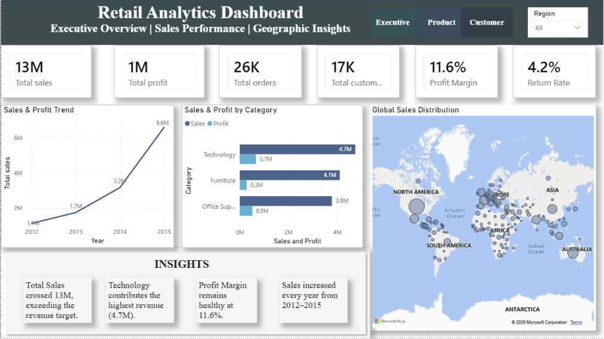
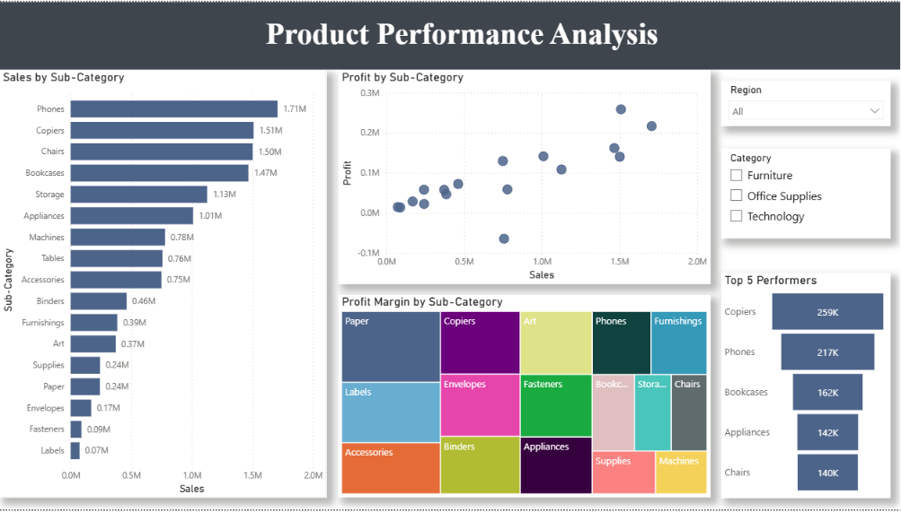
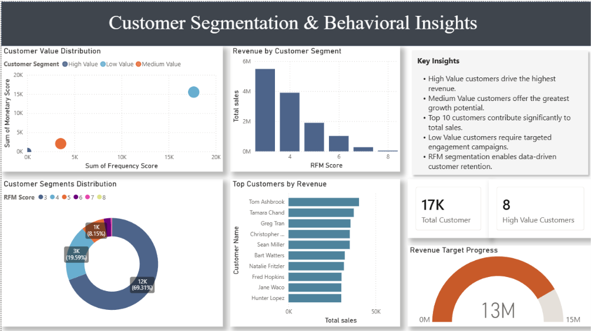

# Retail Analytics Dashboard

## 📌 Project Overview

This project marks my **first end-to-end Power BI analytics project**, developed using the Global Superstore dataset. It demonstrates the complete business intelligence workflow, including data cleaning, data modeling, DAX calculations, interactive dashboard design, and business insight generation.

The dashboard provides valuable insights into sales performance, product analysis, and customer segmentation (RFM) to support data-driven business decisions.
## Dashboard Preview

### Executive Overview

### Product Performance

### Customer Segmentation (RFM)

---

## 🎯 Objectives

- Analyze overall business performance.
- Evaluate product and category performance.
- Segment customers using RFM Analysis.
- Monitor key business KPIs.
- Present actionable business insights through interactive dashboards.

---

## 📊 Dashboard Features

### Executive Overview
- Sales, Profit, Orders & Customers KPIs
- Sales Trend Analysis
- Regional Sales Map
- Category Performance
- Business Insights

### Product Performance
- Category & Sub-Category Analysis
- Top Performing Products
- Sales vs Profit Analysis

### Customer Segmentation (RFM)
- Customer Value Segmentation
- Top Customers
- RFM Analysis
- Customer Insights

---

## 🛠 Tools & Technologies

- Power BI Desktop
- Power Query
- DAX
- Data Modeling
- Data Visualization

---

## 📈 Key KPIs

- Total Sales
- Total Profit
- Profit Margin
- Total Orders
- Total Customers
- Return Rate

---

## 💡 Key Business Insights

- Technology emerged as the highest revenue-generating category.
- High-value customers contributed significantly to overall revenue.
- Medium-value customers present strong upselling opportunities.
- Interactive dashboards support faster, data-driven decision-making.

---

## 🚀 Skills Demonstrated

- Data Cleaning & Transformation
- Data Modeling
- DAX Measures
- Dashboard Design
- Business Intelligence
- Customer Segmentation (RFM)
- Data Storytelling

---

## 👤 Author

**Shanmika R**

Electronics & Communication Engineering Student | Aspiring Data Analyst

**Skills:** Power BI • Power Query • DAX • SQL • Python 
